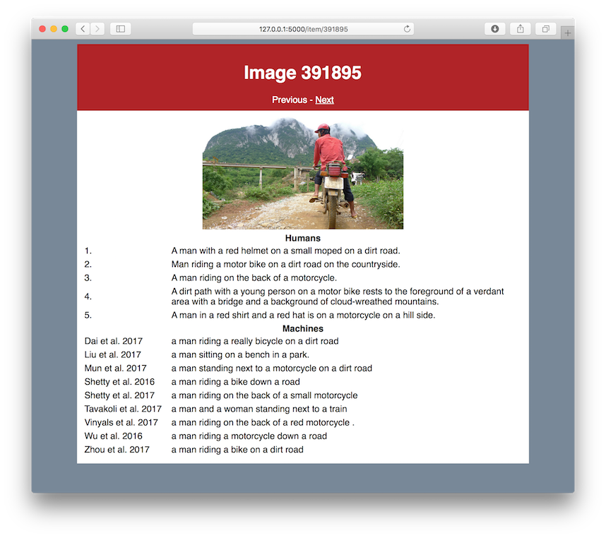

# Output inspector

This is a lightweight tool to inspect the results of different image description
systems on the MS COCO validation set. It automatically downloads the images as
you browse through the results. This saves you from having to download *all* the
images in the dataset. I've also provided a script to download the images, if you
need to work offline.

## Requirements

* Python 3.6
* Flask 0.12

Other versions may work, but remain untested.

## Screenshot
Here's a preview of the tool. There's a simple navigation menu (previous, next),
with the image below, followed by the human-generated descriptions and the descriptions
generated by nine systems.

## How to run this tool

To run the tool, just use `python resultsviewer.py` on the command line.
If you want to download the images first, run `python download_images.py` and wait for the script to complete. This may take a long time.
